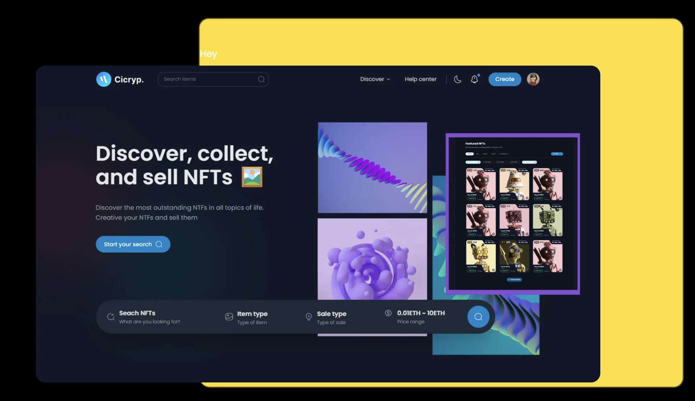

# NFT Marketplace DApp

With the help of our blockchain NFT (Non-Fungible Token) Marketplace DApp, explore the world of digital ownership and creativity. With the help of this innovative platform, producers and collectors may tokenize and exchange one-of-a-kind digital assets on the blockchain in a safe and transparent manner.

A decentralized marketplace is offered by My NFT Marketplace DApp, allowing creators to mint, display, and sell their digital works as NFTs. Each unique and indivisible NFT represents ownership of digital assets, including music, films, art, virtual real estate, and more.

## Project Overview

